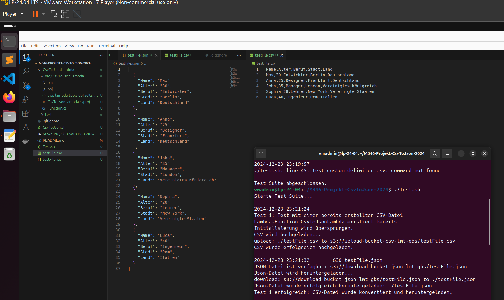
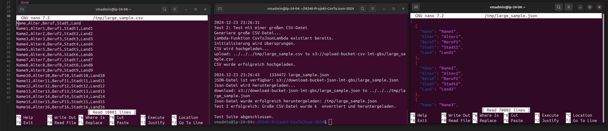

# M346 Csv2Json

## **Projektübersicht**

### **Aufgabe**:

EEin CSV_BUCKET (INPUT) und ein JSON_BUCKET (OUTPUT) sollen zusammen mit einer Lambda-Funktion (bei uns in C# programmiert) einen Csv2JsonConverter bilden. Sobald eine CSV-Datei in den INPUT-Bucket hochgeladen wird, soll ein Trigger ausgelöst werden, der die Lambda-Funktion ausführt.

---

## **CsvToJson.sh**

### **Beschreibung:**

Dieser Skript ist der Hauptkern vom Csv2Json Converter. Er initialiesiert, wenn noch nicht vorhanden, die zwei S3 Buckets CSV_BUCKET und JSON BUCKET, sowie die Lambda Funktion mit dem C# Converter.

### **Ausführung:**
Navigieren sie auf der Konsole in das Verzeichnis M346-Projekt-CSVTOJSON-2024.

Beachten sie beim Ausführen, dass sie einen Pfad angeben und zugriff auf ihre AWS über die Linux Console haben. 

Führen Sie das Script mit folgendem Befehl aus:
```bash
chmod +x CsvToJson.sh
./CsvToJson.sh <Pfad-zur-CSV-Datei> 
```
Führen Sie den Test mit folgendem Befehl aus:
```bash
chmod +x CsvToJson.sh
./Test.sh
```

---

## **Tests**

1. **Korrekte CSV-Datei**
2. **Grosse CSV-Datei**

  
---

## TestProtokoll
Test 1 wurde am 23.12.2024 23:21:24 erfolgreich abgeschlossen. Das Csv wurde erfolgreich auf Json konvertiert.

Test 2 wurde am 23.12.2024 23:21:24 erfolgreich abgeschlossen. Wie man sieht haben beide Dateien Csv und Json sehr viele Zeilen.



Test 1:

```csv
Name,Alter,Beruf,Stadt,Land
Max,30,Entwickler,Berlin,Deutschland
Anna,25,Designer,Frankfurt,Deutschland
John,35,Manager,London,Vereinigtes Königreich
Sophia,28,Lehrer,New York,Vereinigte Staaten
Luca,40,Ingenieur,Rom,Italien
```

Konvertiertes Json:

```json
[
  {
    "Name": "Max",
    "Alter": 30,
    "Beruf": "Entwickler",
    "Stadt": "Berlin",
    "Land": "Deutschland"
  },
  {
    "Name": "Anna",
    "Alter": 25,
    "Beruf": "Designer",
    "Stadt": "Frankfurt",
    "Land": "Deutschland"
  },
  {
    "Name": "John",
    "Alter": 35,
    "Beruf": "Manager",
    "Stadt": "London",
    "Land": "Vereinigtes Königreich"
  },
  {
    "Name": "Sophia",
    "Alter": 28,
    "Beruf": "Lehrer",
    "Stadt": "New York",
    "Land": "Vereinigte Staaten"
  },
  {
    "Name": "Luca",
    "Alter": 40,
    "Beruf": "Ingenieur",
    "Stadt": "Rom",
    "Land": "Italien"
  }
]

```


---

## **Reflexion**

Im Verlauf dieses Projekts haben wir wertvolle Erkenntnisse gewonnen, die uns sowohl in unserer technischen Kompetenz als auch in unserer Herangehensweise an komplexe Aufgaben weitergebracht haben. Ein entscheidender Punkt, den wir gelernt haben, ist, wie wichtig es ist, genau zu verstehen, was man tut. Dies zeigte sich insbesondere bei der Arbeit mit AWS-Komponenten, die uns zu Beginn vor einige Herausforderungen stellten. Besonders der Umgang mit dem S3-Trigger, der auf den CSV_BUCKET angewendet wurde, war ein Bereich, der nicht sofort klar war. Wir mussten uns intensiv mit der Funktionsweise von AWS Lambda und S3 beschäftigen, um den gewünschten Ablauf und Trigger zu konfigurieren. Diese Erfahrung hat uns gezeigt, dass es nicht nur wichtig ist, die Grundlagen zu verstehen, sondern auch die spezifischen Details der verwendeten Tools und Technologien zu kennen.

Ein weiterer wichtiger Aspekt, den wir während des Projekts erfuhren, war die Bedeutung des Managements. Zu Beginn des Projekts waren wir uns nicht immer sicher, wie wir die Aufgaben am besten verteilen sollten, was dazu führte, dass einige Teammitglieder stärker belastet wurden als andere. Ein besserer Managementansatz hätte uns geholfen, die Aufgaben effektiver und gleichmäßiger zu verteilen, sodass jeder im Team gleichmäßig zum Fortschritt des Projekts beitragen konnte. Dies ist definitiv eine Lektion, die wir in zukünftigen Projekten anwenden werden. Eine klare und faire Aufgabenverteilung hätte uns geholfen, die Arbeit effizienter zu gestalten und Stresssituationen zu vermeiden.

Trotz dieser Herausforderungen war das Projekt insgesamt sehr spannend und lehrreich. Wir hatten die Möglichkeit, unser technisches Wissen zu erweitern und neue Tools und Technologien auszuprobieren, was sowohl motivierend als auch bereichernd war. Besonders der Prozess des Deployens einer Lambda-Funktion und der Arbeit mit S3-Buckets hat uns neue Perspektiven auf Cloud-basierte Entwicklungs- und Automatisierungsprozesse eröffnet. Wir haben erkannt, wie wichtig es ist, ein gutes Verständnis für die Infrastruktur zu haben, auf der unsere Anwendungen laufen, und wie man diese Infrastruktur so effizient wie möglich nutzt.

Zusammenfassend können wir sagen, dass dieses Projekt uns sowohl technisch als auch organisatorisch weitergebracht hat. Wir haben nicht nur unsere Fähigkeiten im Umgang mit AWS und Cloud-Technologien verbessert, sondern auch gelernt, wie wichtig Teamarbeit und eine klare Aufgabenverteilung sind. Dieses Projekt wird uns auf jeden Fall gut in Erinnerung bleiben, und wir sind zuversichtlich, dass wir die gewonnenen Erkenntnisse in zukünftigen Projekten anwenden können, um noch effektiver zu arbeiten.